# AI Trip Planner

A full-stack AI travel planning platform powered by **multi-agent orchestration**. Users describe their ideal trip in natural language, and a crew of specialized AI agents collaborates to produce a complete itinerary — day-by-day plans, hotel recommendations, flight options, train routes, and cost breakdowns.

**Key highlights:**

- **15 specialized AI agents** organized into 7 crews, orchestrated via a DAG-based flow
- **5 MCP tool servers** (Model Context Protocol) providing domain-specific travel data
- **Real-time progress streaming** — watch each agent crew complete its work via SSE
- **Intent slot extraction** — two-layer (regex + LLM) approach with multi-turn accumulation
- **Browsable travel packages** with semantic search (pgvector), i18n, and category filtering

## Screenshots

| Homepage | Travel Packages |
|----------|----------------|
|  |  |

| AI Chat — Markdown Itinerary with Clickable Citations | Citation Panel with Favicons |
|--------------------------------------------------------|------------------------------|
|  |  |

| i18n — 繁體中文 Locale |
|------------------------|
|  |

## Architecture Overview

```mermaid
graph TD
    Browser["🌐 Browser"]
    Frontend["Frontend<br/><small>React 19 · TypeScript · Tailwind · Zustand</small>"]
    Backend["Backend<br/><small>FastAPI · SQLModel · JWT · Redis rate-limit</small>"]
    Postgres["PostgreSQL<br/>+ pgvector"]
    Redis["Redis"]
    Neo4j["Neo4j<br/>Graphiti"]
    Agents["Agent Layer<br/><small>CrewAI Flow · 7 Crews · 15 Agents<br/>+ Link Validator</small>"]
    MCP1["Japan MCP<br/><small>5 tools</small>"]
    MCP2["Taiwan MCP<br/><small>4 tools</small>"]
    MCP3["Flights MCP<br/><small>2 tools</small>"]
    MCP4["Utilities MCP<br/><small>3 tools</small>"]
    MCP5["Knowledge MCP<br/><small>3 tools</small>"]

    Browser --> Frontend
    Frontend -- "REST / WebSocket / SSE" --> Backend
    Backend --> Postgres & Redis & Neo4j
    Postgres & Redis & Neo4j --> Agents
    Agents --> MCP1 & MCP2 & MCP3 & MCP4 & MCP5

    style Frontend fill:#3b82f6,color:#fff
    style Backend fill:#10b981,color:#fff
    style Agents fill:#f59e0b,color:#fff
    style Postgres fill:#6366f1,color:#fff
    style Redis fill:#ef4444,color:#fff
    style Neo4j fill:#6366f1,color:#fff
```



## Agent Orchestration — Deep Dive

The orchestration pipeline transforms a free-form user message like _"I want to go to Japan for 5 days in March with my family, budget around $3000"_ into a structured, multi-section travel plan. Here's how:

### 1. Intent Parsing & Slot Extraction

Every user message passes through a **two-layer extraction pipeline** that progressively fills an intent slot object:

```mermaid
graph LR
    User["💬 User Message<br/><small>我想去日本玩5天<br/>2個大人加1個5歲小孩</small>"]

    subgraph extraction ["Two-Layer Extraction"]
        Regex["⚡ Regex Layer<br/><small>(instant, zero-cost)</small><br/><br/>destination: japan<br/>duration_days: 5<br/>num_travelers: 3<br/>children_ages: 5 "]
        LLM["🤖 LLM Layer<br/><small>(async)</small><br/><br/>budget_usd: null<br/>trip_style: family<br/>preferences:<br/>kid-friendly"]
    end

    Slots[("🗃️ Session Intent Slots<br/><small>JSONB in Postgres</small>")]

    User --> Regex & LLM
    Regex --> Slots
    LLM --> Slots

    style Regex fill:#fbbf24,color:#000
    style LLM fill:#818cf8,color:#fff
    style Slots fill:#34d399,color:#000
```



**Layer 1 — Rule-Based Regex** (instant, zero-cost):
Bilingual patterns (EN/ZH) catch common slot values before the LLM call even begins:
- Destination: `japan|日本|taiwan|台灣`
- Duration: `5天|5 days|一週`
- Travelers: `2人|2 people|三位`
- Budget: `預算3000|budget $3000`
- Children: `小孩5歲|child age 5`
- Dates: ISO format `2025-03-15`

**Layer 2 — LLM Extraction** (async):
The LLM system prompt instructs the model to append a hidden `SLOTS_JSON: {...}` line. The backend strips this from the visible response and parses it for additional slots the regex couldn't catch (e.g. `trip_style`, `preferences`).

**Multi-Turn Accumulation**:
Slots persist across conversation turns in `ChatSession.intent_slots` (JSONB). Each new message merges into existing slots — users can refine incrementally:


**Completeness Check**: Planning triggers only when the minimum required slots are filled:
- `destination` (required)
- `duration_days` OR `start_date` + `end_date` (required)
- `num_travelers` (required)

If incomplete, the system asks targeted clarifying questions for exactly what's missing.

### 2. Destination Routing

Once slots are complete, a router selects the appropriate agent crew:

```mermaid
graph TD
    Check{"slots_complete?"}
    Ask["🔄 Ask user<br/>missing fields"]
    Router{"🧭 Router<br/>destination?"}
    Japan["🇯🇵 Japan Crew<br/><small>5 agents</small>"]
    Taiwan["🇹🇼 Taiwan Crew<br/><small>4 agents</small>"]

    Check -- "No" --> Ask
    Ask -.-> Check
    Check -- "Yes" --> Router
    Router -- "japan" --> Japan
    Router -- "taiwan" --> Taiwan

    style Check fill:#f59e0b,color:#000
    style Japan fill:#ef4444,color:#fff
    style Taiwan fill:#3b82f6,color:#fff
```



### 3. Crew Execution Pipeline (DAG Flow)

After routing, the system executes a **sequential pipeline of 4 crew stages**. Each crew runs its agents in parallel internally, and the output feeds into the next crew:

```mermaid
graph TD
    subgraph flow ["CrewAI Flow (DAG)"]
        direction TB

        subgraph C1 ["1️⃣ Intent Crew"]
            A1["Intent Parser"]
        end

        subgraph C2 ["2️⃣ Destination Crew <small>(parallel)</small>"]
            A2["Itinerary Agent"]
            A3["Hotel Agent"]
            A4["Train Agent"]
            A5["Festival Agent"]
            A6["Ski Agent ❄️<br/><small>conditional</small>"]
        end

        subgraph C3 ["3️⃣ Booking Crew"]
            A7["Flight Agent ✈️"]
            A8["eSIM Agent 📱"]
        end

        subgraph C4 ["4️⃣ Advisory Crew"]
            A9["Currency Agent 💱"]
            A10["Family Advisor 👨‍👩‍👧<br/><small>conditional</small>"]
        end

        subgraph C5 ["5️⃣ Synthesis Crew"]
            A11["Itinerary Writer ✍️<br/><small>creative LLM</small>"]
        end

        subgraph C6 ["6️⃣ Link Validator"]
            A12["Link Validator 🔗<br/><small>code-only (no LLM)</small>"]
        end

        C1 --> C2 --> C3 --> C4 --> C5 --> C6
    end

    style C1 fill:#6366f1,color:#fff
    style C2 fill:#ef4444,color:#fff
    style C3 fill:#f59e0b,color:#000
    style C4 fill:#10b981,color:#fff
    style C5 fill:#ec4899,color:#fff
    style C6 fill:#64748b,color:#fff
```



#### All 7 Crews and 15 Agents

| Crew | Agents | LLM Profile | Role |
|------|--------|-------------|------|
| **Intent** | Intent Parser | `fast` (temp 0.3) | Extract structured slots from natural language |
| **Japan** | Itinerary, Hotel, Train, Festival, Ski\* | `reasoning` (temp 0.7) | Plan Japan-specific trip components in parallel |
| **Taiwan** | Itinerary, Hotel, Train, Festival | `reasoning` (temp 0.7) | Plan Taiwan-specific trip components in parallel |
| **Booking** | Flight, eSIM | `fast` (temp 0.3) | Search flights and data plans |
| **Advisory** | Currency, Family Advisor\* | `fast` (temp 0.3) | Exchange rates, kid-friendly advice |
| **Synthesis** | Itinerary Writer | `creative` (temp 0.8) | Assemble all data into a polished markdown plan |
| **Link Validator** | Link Validator | _code-only_ (no LLM) | HEAD-check all URLs; remove dead links from response |

\* _Conditional agents_ — Ski Agent activates only when `has_skiing=true`; Family Advisor activates only when `children_ages` is present.

#### LLM Configuration

Three LLM profiles optimize cost and quality across different agent tasks:

```python
llm_fast     = primary_model,  temp=0.3   # Structured extraction, searches
llm_reasoning = primary_model,  temp=0.7   # Complex planning, reasoning
llm_creative  = fallback_model, temp=0.8   # Final prose synthesis
```

Models are configured via `.env` (`LLM_MODEL_PRIMARY` / `LLM_MODEL_FALLBACK`) and routed through **OpenRouter**, supporting any model on the platform.

### 4. Real-Time Progress Tracking

The frontend receives **live progress events** via Server-Sent Events (SSE) as each crew completes its work:

```
GET /api/v1/chat/sessions/{id}/flow-events?token={jwt}
Content-Type: text/event-stream

data: {"step":"intent_parsing",  "crew":"intent",   "status":"active", "slots":{...}}
data: {"step":"routing",         "crew":"router",   "status":"active"}
data: {"step":"planning",        "crew":"japan",    "status":"active"}
data: {"step":"post_processing", "crew":["booking","advisory"], "status":"active"}
data: {"step":"synthesizing",    "crew":"synthesis", "status":"active"}
data: {"step":"link_validation", "crew":"link_validator", "status":"active"}
data: {"step":"complete",        "crew":"all",      "status":"done"}
```

Events are published via **Redis Pub/Sub** (channel: `flow:{session_id}`) and forwarded to the client as SSE. This allows the UI to show a step-by-step progress indicator while agents work.

### 5. MCP Tool Servers

Each agent crew calls domain-specific **MCP tool servers** via the [Model Context Protocol](https://modelcontextprotocol.io/) (Streamable HTTP transport). The MCP servers run as independent Docker services:

| MCP Server | Port | Tools | Examples |
|-----------|------|-------|----------|
| **Japan Travel** | 8201 | 5 | Itinerary suggestions, ryokans, JR Pass routes, festivals by month, ski resorts |
| **Taiwan Travel** | 8202 | 4 | Itinerary suggestions, hotels, HSR/TRA routes, temple festivals |
| **Flights** | 8203 | 2 | Multi-carrier flight search, detailed flight info with baggage/amenities |
| **Utilities** | 8204 | 3 | Currency conversion (10 currencies), eSIM plans, family travel advice by age |
| **Knowledge** | 8205 | 3 | Semantic search (pgvector), knowledge graph (Neo4j/Graphiti), user preferences |

## Tech Stack

| Layer | Technology |
|-------|------------|
| Frontend | React 19, TypeScript, Vite 6, Tailwind CSS, Zustand, React Router 7 |
| Backend | FastAPI, SQLModel, SQLAlchemy 2 (async), Alembic, Pydantic v2 |
| Agent Orchestration | CrewAI (Flow + Crews), 15 specialized agents, 3 LLM profiles |
| Tool Protocol | MCP (Model Context Protocol) via FastMCP, Streamable HTTP |
| LLM Gateway | OpenRouter (model-agnostic — swap models via `.env`) |
| Database | PostgreSQL 17 + pgvector, Neo4j 5 (Graphiti knowledge graph) |
| Cache / Rate Limit | Redis 7 (sliding window + daily AI query caps) |
| Auth | Google OAuth 2.0, LINE Login, JWT (access + refresh tokens) |
| CI/CD | GitHub Actions, GitLab CI (lint → build → test) |
| i18n | English (default) + Traditional Chinese, localStorage preference |
| Infrastructure | Docker Compose (11 services), Nginx reverse proxy |

## Project Structure

```
ai-agent-trip/
├── backend/                      # FastAPI API server
│   ├── app/
│   │   ├── api/v1/               # Route handlers
│   │   │   ├── auth.py           #   OAuth login/callback, JWT refresh
│   │   │   ├── chat.py           #   Chat sessions, messages, SSE flow events
│   │   │   ├── packages.py       #   Travel packages CRUD + semantic search
│   │   │   └── ws.py             #   WebSocket real-time chat
│   │   ├── core/                 # Security, Redis, rate limiting, exceptions
│   │   ├── models/               # SQLModel DB models (User, ChatSession, Package)
│   │   ├── schemas/              # Pydantic request/response schemas
│   │   ├── services/             # Business logic
│   │   │   ├── orchestrator.py   #   ★ LLM orchestration + slot extraction
│   │   │   ├── flow_events.py    #   ★ Redis pub/sub for progress tracking
│   │   │   ├── chat_service.py   #   Session/message CRUD
│   │   │   └── package_service.py#   Package queries + i18n overlay
│   │   └── tests/                # 22 E2E tests (pytest + httpx)
│   └── alembic/                  # Database migrations
│
├── agents/                       # CrewAI orchestrator + MCP servers
│   ├── orchestrator/
│   │   ├── flow.py               # ★ TripPlanningFlow (DAG entry point)
│   │   ├── state.py              # ★ IntentSlots + TripPlanningState models
│   │   ├── llm_config.py         # LLM profiles (fast/reasoning/creative)
│   │   ├── crews/                # 7 crew definitions
│   │   ├── agents/               # 15 agent definitions
│   │   └── tasks/                # Task templates per crew
│   └── mcp_servers/              # 5 MCP tool servers (FastMCP)
│       ├── japan_travel/         #   5 tools: itinerary, hotel, festival, ski, train
│       ├── taiwan_travel/        #   4 tools: itinerary, hotel, festival, train
│       ├── flights/              #   2 tools: search, details
│       ├── utilities/            #   3 tools: currency, eSIM, family advice
│       └── knowledge/            #   3 tools: semantic search, graph, preferences
│
├── frontend/                     # React SPA
│   └── src/
│       ├── pages/                # Home, Chat, Packages, Itinerary, Login, Profile
│       ├── components/           # Layout, Chat, Package, Itinerary, Auth, Common
│       ├── stores/               # Zustand state (auth, chat, packages)
│       └── lib/                  # API client, WebSocket, types, i18n
│
├── nginx/                        # Reverse proxy config
├── scripts/                      # DB init (pgvector), seed data, Graphiti setup
├── .github/workflows/ci.yml      # GitHub Actions pipeline
├── .gitlab-ci.yml                # GitLab CI pipeline
├── docker-compose.yml            # 11 services
├── Makefile                      # Dev commands
└── .env.example                  # All environment variables
```

## Getting Started

### Prerequisites

- **Docker** >= 24.0 and **Docker Compose** >= 2.20
- An **OpenRouter API key** ([openrouter.ai](https://openrouter.ai))
- (Optional) Google OAuth and/or LINE Login credentials

### 1. Clone and configure

```bash
git clone https://github.com/nwpie/ai-agent-trip.git
cd ai-agent-trip
cp .env.example .env
```

Edit `.env` and set at minimum:

```env
OPENROUTER_API_KEY=sk-or-v1-your-key-here
```

### 2. Build and start all services

```bash
make up-build
```

This starts all 11 services. Wait for health checks to pass (~30s).

### 3. Run database migration and seed data

```bash
make migrate
make seed
```

### 4. Open the app

| Service | URL |
|---------|-----|
| Frontend | http://localhost:5373 |
| Backend API | http://localhost:8200 |
| API Docs (Swagger) | http://localhost:8200/docs |

## API Endpoints

### Auth (`/api/v1/auth`)
| Method | Endpoint | Description |
|--------|----------|-------------|
| GET | `/auth/google` | Redirect to Google OAuth |
| GET | `/auth/google/callback` | Google OAuth callback |
| GET | `/auth/line` | Redirect to LINE Login |
| GET | `/auth/line/callback` | LINE OAuth callback |
| POST | `/auth/refresh` | Refresh JWT token |
| POST | `/auth/logout` | Revoke refresh token |

### Chat (`/api/v1/chat`)
| Method | Endpoint | Description |
|--------|----------|-------------|
| POST | `/chat/sessions` | Create new chat session |
| GET | `/chat/sessions` | List user's sessions |
| GET | `/chat/sessions/{id}` | Get session with intent slots |
| POST | `/chat/sessions/{id}/messages` | Send message (triggers AI orchestration) |
| GET | `/chat/sessions/{id}/flow-events` | SSE stream of agent progress |

### Packages (`/api/v1/packages`)
| Method | Endpoint | Description |
|--------|----------|-------------|
| GET | `/packages?locale=zh` | List with filters + i18n |
| GET | `/packages/{slug}` | Detail with day-by-day itinerary |
| GET | `/packages/search/semantic?q=...` | pgvector semantic search |

### WebSocket
| Protocol | Endpoint | Description |
|----------|----------|-------------|
| WS | `/api/v1/ws/chat/{session_id}?token={jwt}` | Real-time chat streaming |

## Port Mapping

All host ports use a **+200 offset** from standard ports to avoid conflicts:

| Service | Container | Host |
|---------|-----------|------|
| PostgreSQL + pgvector | 5432 | **5632** |
| Redis | 6379 | **6579** |
| Neo4j HTTP / Bolt | 7474 / 7687 | **7674** / **7887** |
| Backend API | 8000 | **8200** |
| Frontend (Vite) | 5173 | **5373** |
| MCP: Japan / Taiwan / Flights / Utils / Knowledge | 8001–8005 | **8201–8205** |

## Development

### Makefile Commands

```bash
make up              # Start all services
make up-build        # Build and start all services
make down            # Stop all services
make logs            # Tail all service logs
make migrate         # Run Alembic migrations
make seed            # Seed 17 travel packages (8 Japan + 9 Taiwan)
make test-backend    # Run 22 backend E2E tests
make test-frontend   # Run frontend tests (vitest)
make lint-backend    # Lint with ruff
make psql            # Open psql shell
make clean           # Stop + remove volumes
```

### CI Pipeline

Both GitHub Actions and GitLab CI run the same 3-stage pipeline:

```mermaid
graph LR
    Lint["🔍 Lint<br/>ruff + tsc"]
    Build["🔨 Build<br/>3 Docker images"]
    Test["🧪 Test<br/>22 E2E via Docker Compose"]

    Lint --> Build --> Test

    style Lint fill:#fbbf24,color:#000
    style Build fill:#3b82f6,color:#fff
    style Test fill:#22c55e,color:#fff
```



### Environment Variables

See [`.env.example`](.env.example) for all variables. Key ones:

| Variable | Description |
|----------|-------------|
| `OPENROUTER_API_KEY` | OpenRouter API key (required for AI features) |
| `LLM_MODEL_PRIMARY` | Primary model for intent parsing and planning |
| `LLM_MODEL_FALLBACK` | Fallback model for synthesis |
| `DATABASE_URL` | PostgreSQL connection string |
| `JWT_SECRET_KEY` | JWT signing secret |
| `GOOGLE_CLIENT_ID` | Google OAuth client ID |
| `LINE_CHANNEL_ID` | LINE Login channel ID |

## License

This project is proprietary. All rights reserved.
